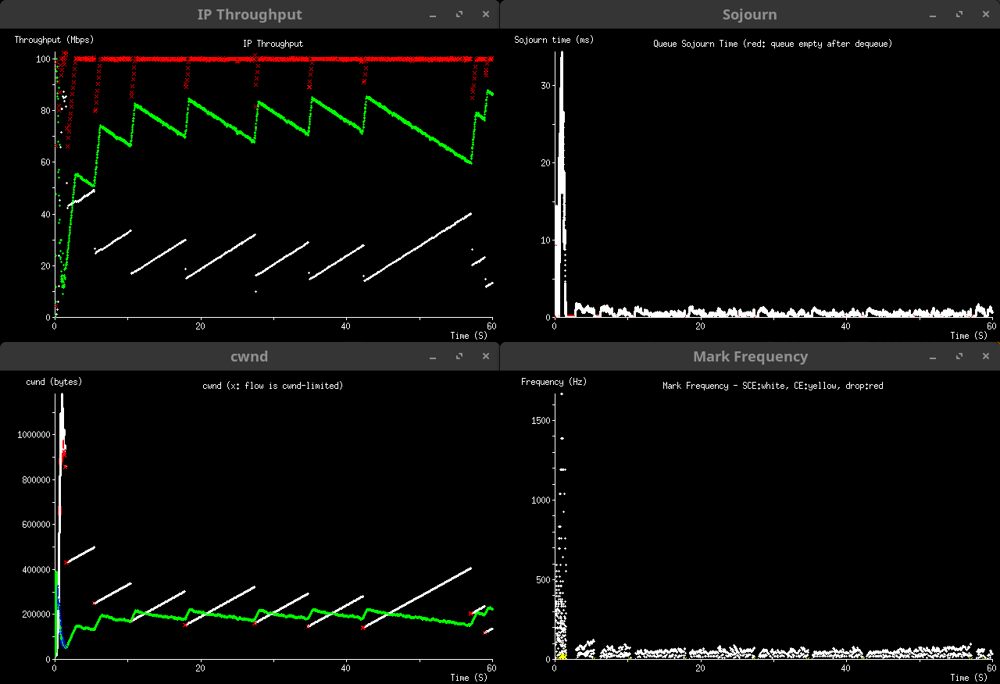

# Scim Congestion Control Simulator

Scim is a discrete event simulator for testing
[ECN](https://datatracker.ietf.org/doc/rfc3168/)-based congestion control, with
a focus on high-fidelity signaling.

Scim was written for educational use, and for quickly trying new ideas.  It was
originally written to test
[Multiplicative Decrease Scaling](https://github.com/heistp/md-scaling/).
It does not aim to precisely simulate real-world networks, but to show that
congestion control algorithms (CCAs) and Active Queue Management (AQM)
algorithms behave as expected in an idealized environment.

## Installation

Scim can run on any Go-supported platform, but xplot is required to view the
plots.

1.  Install [Go](https://go.dev/dl) (1.22 or later required).
2.  `mkdir -p ~/go/src/github.com/heistp && cd "$_"`
3.  `git clone https://github.com/heistp/scim`
4.  Install [xplot](http://www.xplot.org/).

Note: with GCC 14, I had to build `xplot` from
[xplot-0.90.7.1.tar.gz](http://www.xplot.org/xplot/xplot-0.90.7.1.tar.gz)
as follows:

`CFLAGS="-Wno-error=implicit-int -Wno-error=implicit-function-declaration" ./configure`
`make`

## Running and Configuring

Change to the scim directory.  Either use the `./run` script (requires bash), or
use `go build` manually and run `./scim`.

Scim is configured via the file `config.go`, so the program must be recompiled
each time the config is changed.  That's what the run script does.

## Sample Plot

In Figure 1, we see Reno vs Reno-SCE at two different RTTs in a 100 Mbps
bottleneck, converging to equal cwnd, with sojourn time minimized by the DelTiM
AQM.

*Figure 1: Reno (80 ms, in white) vs Reno-SCE (20 ms, in green) at 100 Mbps
with the DelTiM AQM*

## Features

General:
* Capacity seeking flows
* Per-flow path RTTs
* Flow scheduling
* Bottleneck rate changes
* Pacing
* Delayed ACKs
* Pluggable slow-start and CCAs
* [SCE](https://datatracker.ietf.org/doc/draft-morton-tsvwg-sce/) signaling

CCAs:
* Reno and Reno-SCE
* [CUBIC](https://datatracker.ietf.org/doc/rfc9438/) and CUBIC-SCE
* [Scalable](https://datatag.web.cern.ch/papers/pfldnet2003-ctk.pdf) and
  Scalable-SCE
* Maslo (experimental)

AQMs:
* [DelTiC](https://github.com/chromi/sce/blob/sce/net/sched/sch_deltic.c)
* DelTiM (Delay Time Minimization, a DelTiC variant)
* Brick wall (CE threshold)
* Ramp (CE / SCE marking based on linear sojourn time ramp)

Slow-start algorithms:
* Standard ([RFC5681](https://datatracker.ietf.org/doc/rfc5681/))
* [Extended Slow Start with Pacing](https://github.com/heistp/essp/)
* [HyStart++](https://datatracker.ietf.org/doc/rfc9406/)

Plots:
* In-flight bytes
* Cwnd
* Pacing
* TCP sequence
* Queue sojourn time and length
* AQM marking proportion or frequency
* Throughput

Scim does not handle packet loss, only ECN signaling.

It is configured with a list of Handlers (see `main.go`), which form a ring.
Messages between Handlers are sent round-robin style, and events are processed
linearly in time, so that any two simulator runs always produce the same
results.  Each Handler runs in a separate goroutine, but they are synchronized
by the simulator (see `sim.go`) so the result is deterministic.

Scim's emphasis is on robustness rather than performance.  I see it process
around 70k packets/sec on a Ryzen 5 4500U, and 140k packets/sec on a Ryzen 9
5900HX.  YMMV.
